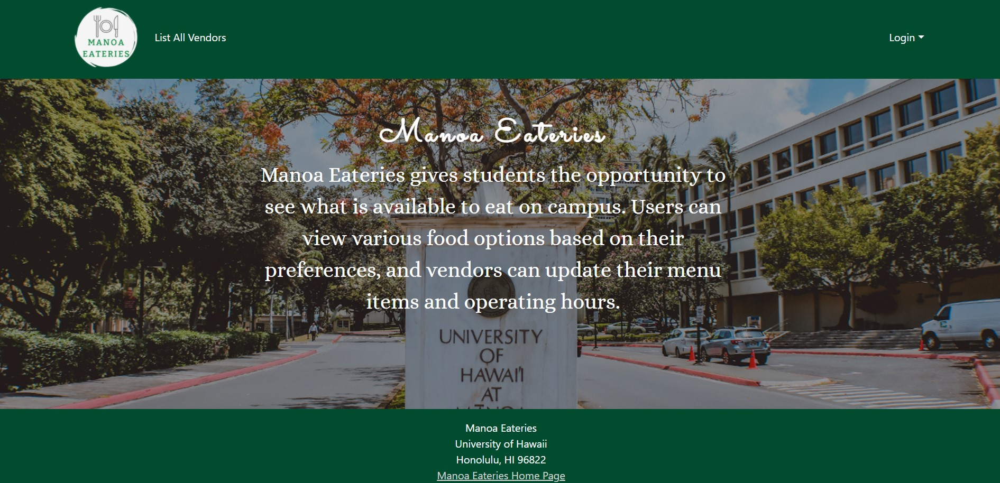
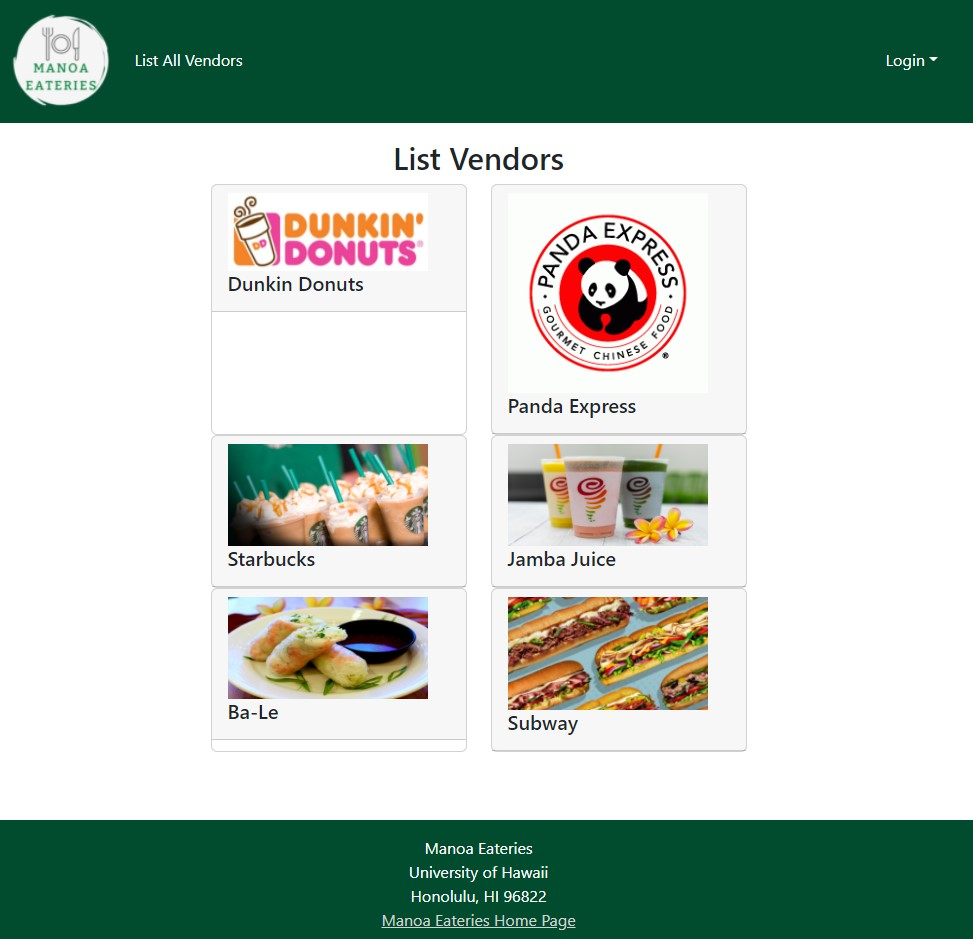
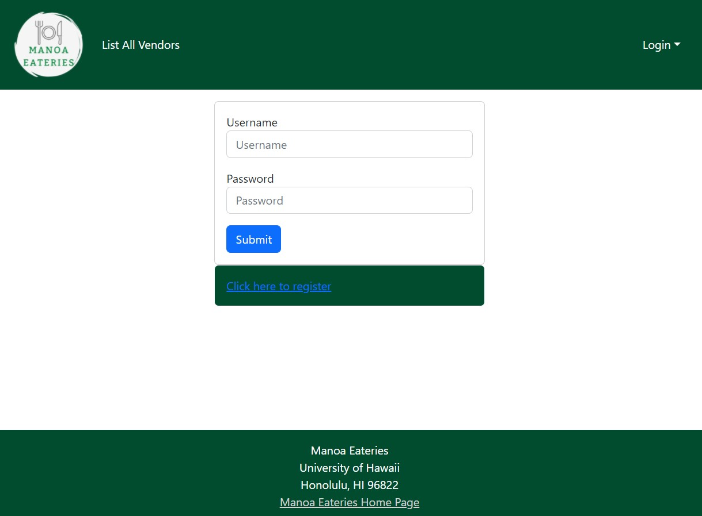
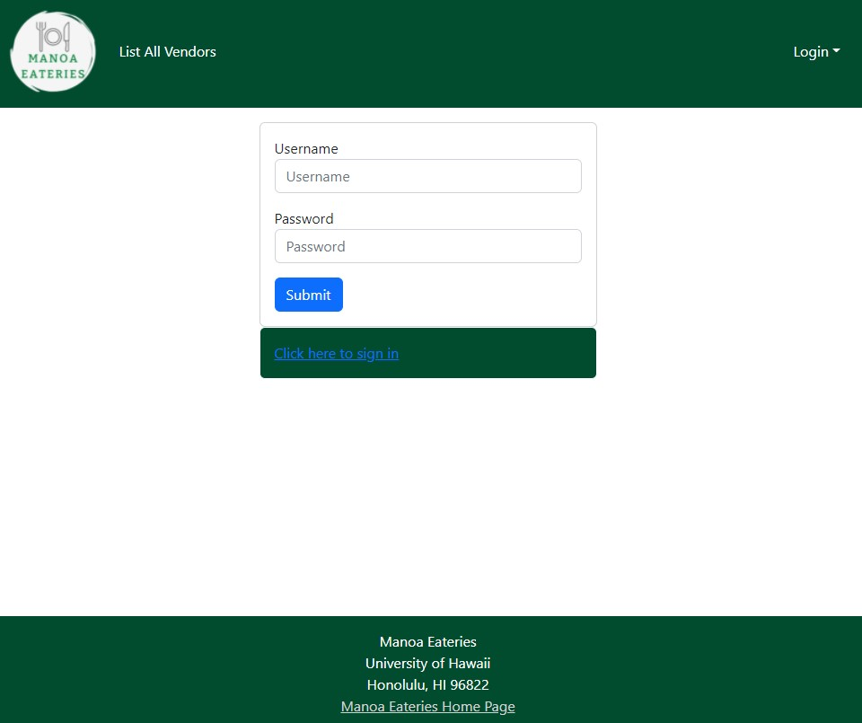
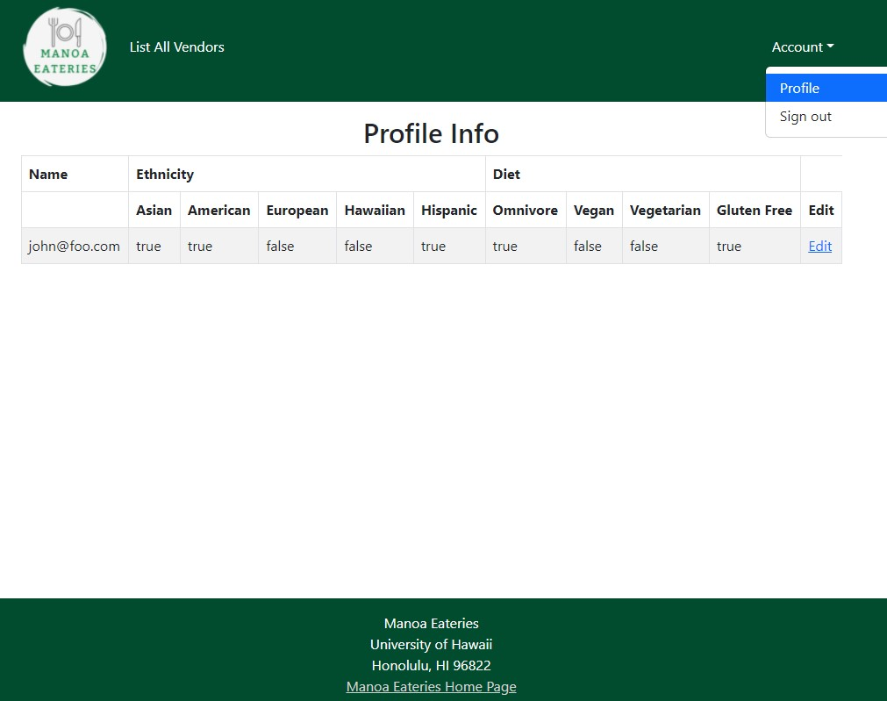
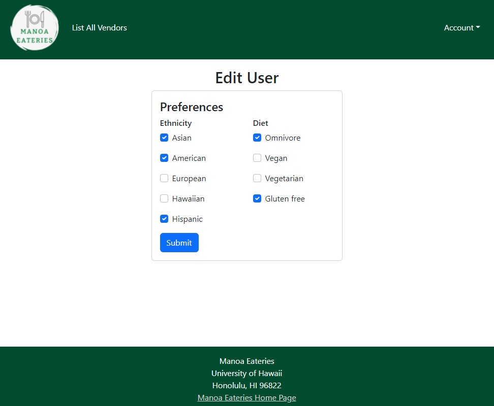
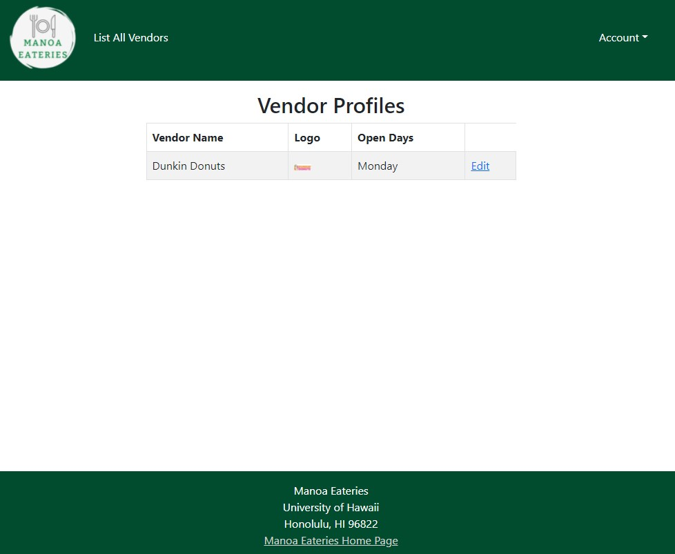
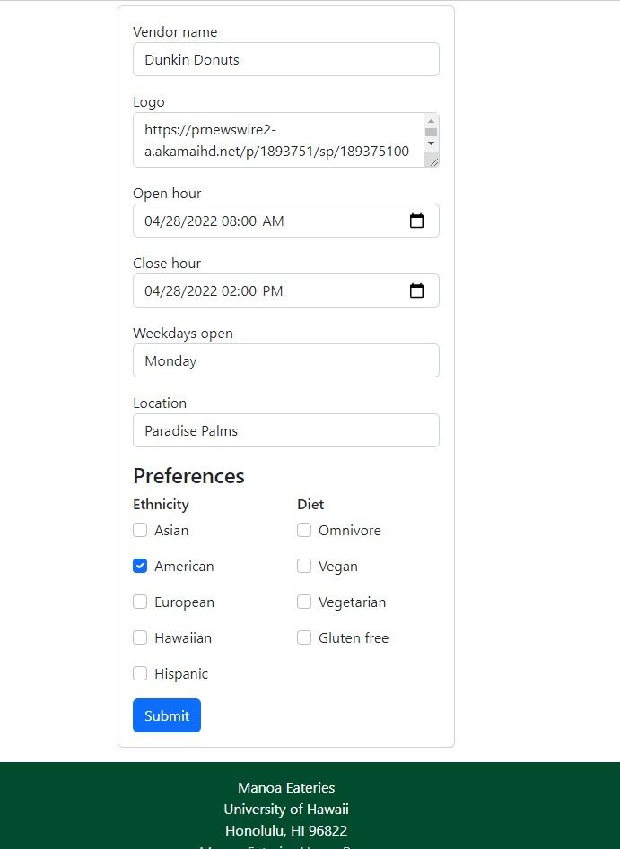
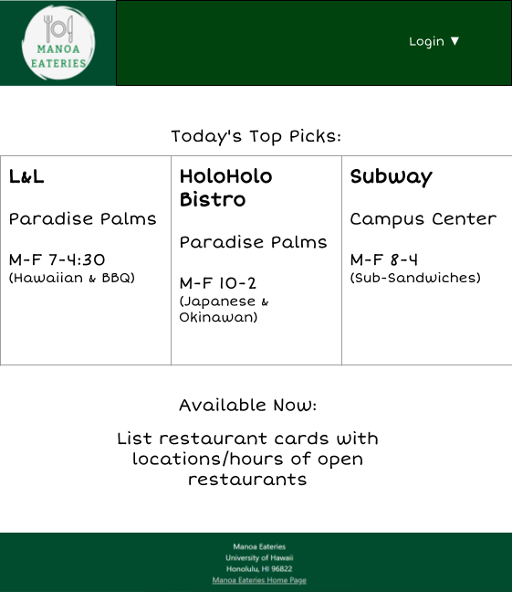

# Manoa Eateries 


## Table of Contents
* [Build Status](#build-status)
* [Overview](#overview)
* [Project Goals](#project-goals)
* [Developer Guide](#developer-guide)
* [User Guide](#user-guide)
* [Mockups](#mockups)
* [Projects](#projects)
* [Deployment](#deployment)

## Build Status


## Overview
Manoa Eateries is a project created for ICS 314 by Brooke Maeda, Andee Gary, Albert D'Sanson, and Eliya Nakamura to provide students with the opportunity to see what is available to eat on campus. Using tools such as Bootstrap, React, HTML, and CSS an application will be made to allow users to view various food options, vendors to add any new items or daily specials. A landing page will show users the ability to see the various food options on campus and filter it out to find what they are looking for.

## Project Goals
- Give users a convenient place to view the menu items of the various food vendors at UHM
- Display menu items based on the specific day and time
- Filter the data based on item type (ethnicity, gluten free, vegetarian, etc.)
- Implement vendor roles that can specify what days and times an establishment is open, and allow for menu changes as needed
- Implement user roles that can specify a person’s dining preferences
- Implement admin roles that can add vendor roles to users and modify any aspect of the system


[Team Contract](https://docs.google.com/document/d/1fNMn6Be5DwtTorRnbEHNBvZuMuU2cnv_35YeOkjgyYU/edit?usp=sharing)
## Developer Guide 
### Installation
First, [install Meteor](https://www.meteor.com/developers/install)

Second, vision the [Manoa Eateries application github page](https://github.com/manoa-eateries/manoa-eateries) and download the sources as a zip file or make a fork of the repo. However you do it, download a copy of the repo to your local computer.

Third, cd into the Manoa Eateries app/ directory and install the libraries with: 
```
$ meteor npm install
```
Fourth, run the system with:
```
$ meteor npm run start
```
If all goes well it will appear at [http://localhost:3000/](http://localhost:3000/)

### ESLint
You are also able to invoke the ESLint command from the command line with:
```
meteor npm run lint
```
Here is an example showing that no ESLint errors were detected:
```
$ meteor npm run lint

> manoa-eateries@ lint /Users/johndoe/github/manoea-eateries/app
> eslint --quiet --ext .jsx --ext .js ./imports ./tests

$
```
ESLint should run without generating any errors
## User Guide
- Landing Page
  <br/><br/>
  When users first enter the site, they are greeted with the landing page.  This displays the mission of Manoa Eateries to let the users know the purpose of this website.


- List All Vendors Page
  <br/><br/>
    Users can see the participating vendors with this page without signing in.  This allows users to see if their restaurants are included in the website and help them to decide if they should sign up.


- Sign in Page
  <br/><br/>
In order for  users to be able to see more than just a list of vendors, they must sign in.  Once signed in, they will still be able to see the list all vendors page in addition to new pages described below.

  
- Sign up Page
  <br/><br/>
    If a user does not have an account with us, they have the ability to create one.


- User Profile Page
  <br/><br/>
    Once logged in, users can navigate to their profile page.  Here they can see their name and preferences.


- Edit User Page
  <br/><br/>
    If a user decides that they want to change their preferences, they can navigate to the edit user page.  With this they can check off what types of food they enjoy.


- Vendor Profile Page
  <br/><br/>
    When a vendor sign in, they can see their profile that contains their name, logo, and when they are open.


- Edit Vendor Page
  <br/><br/>
    If a vendor wants to change their information, they may do so on the edit vendor page.  Here they can set their name, logo, when they are open, location, and preferences they cater to.

## Mockups

- User Home Page
<br/><br/>


## Projects
[Milestone 1](https://github.com/orgs/manoa-eateries/projects/1/views/1)

The goal of this milestone was to create Mockups to see what our pages will look like.  We also made a landing page that tells users the purpose of our website.

[Milestone 2](https://github.com/orgs/manoa-eateries/projects/2/views/2)

For this milestone we wanted to improve functionality by adding pages and forms to our website.

[Milesone 3](https://github.com/orgs/manoa-eateries/projects/3/views/2)

Finally, we want to implement a significant amount of real information into our database.  We also will be receiving community feedback.


## Deployment
[Digital Ocean application](http://143.110.235.49)
