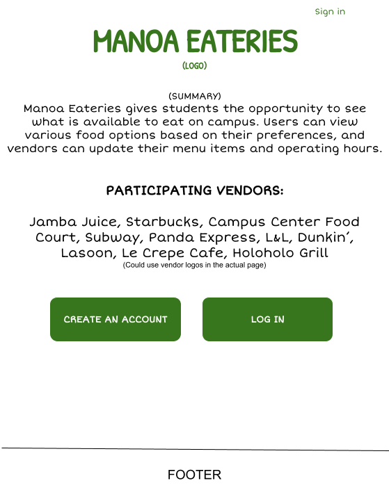
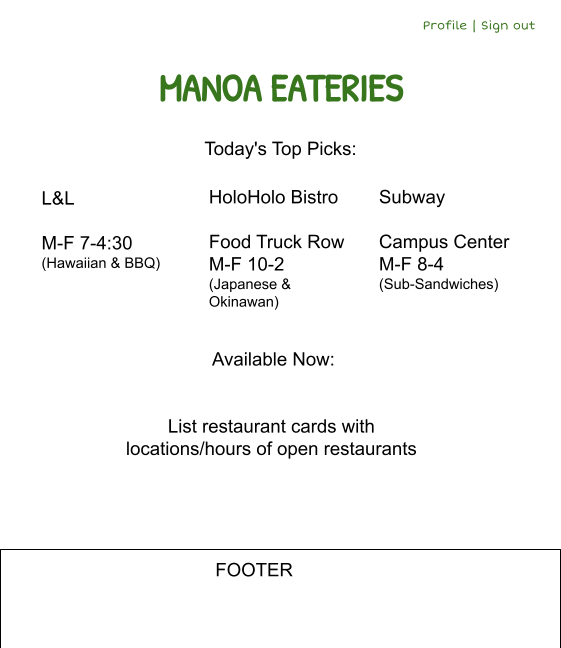

## Manoa Eateries

## Overview
Manoa Eateries is a project that provides students the opportunity to see what is available to eat on campus. Using tools such as Bootstrap, React, HTML, and CSS an application will be made to allow users to view various food options, vendors to add any new items or daily specials. A landing page will show users the ability to see the various food options on campus and filter it out to find what they are looking for.

## Project Goals
- Give users a convenient place to view the menu items of the various food vendors at UHM
- Display menu items based on the specific day and time
- Filter the data based on item type (ethnicity, gluten free, vegetarian, etc.)
- Implement vendor roles that can specify what days and times an establishment is open, and allow for menu changes as needed
- Implement user roles that can specify a person’s dining preferences
- Implement admin roles that can add vendor roles to users and modify any aspect of the system

[Team Contract](https://docs.google.com/document/d/1fNMn6Be5DwtTorRnbEHNBvZuMuU2cnv_35YeOkjgyYU/edit?usp=sharing)
## Mockups
- Landing Page
  

- User Home Page
  

- Vendor Page
  
